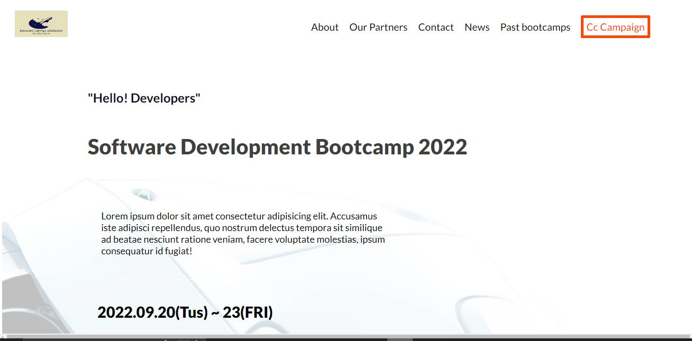
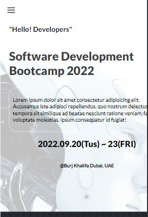

# Software Dev Bootcamp

> This is a project I have done learning in microverse,It is a Software bootcamp website where visitors can understand and learn the main program during the bootcamp and they can learn about partners of the bootcamp as well,In the website I have included many Tech influencers in the world whom motivates me,so if you like the project please don't forget to give it a star.




## Built With

- Major languages
**Html**
**Css**
**Javascript**


## Getting Started


To get a local copy up and running follow these simple example steps.
  

   $ executable <command> [options]
  ```
  $ git clone https://github.com/NatanimA/Miicroverse-Capstone-Module-One.git
  ```

  ```
  $ git checkout -b capstone
  ```

  ```
  $ git pull origin capstone
  ```


### Prerequisites
**No prerequisties needed**

### Setup


### Install


## Authors

👤 **Natanim Abesha**

- GitHub: [@github](https://https://github.com/NatanimA)
- LinkedIn: [LinkedIn](https://linkedin.com/in/natanim-abesha-04a39823a)

## Live Demo

-Demo : https://natanima.github.io/Miicroverse-Capstone-Module-One/

## Acknowledgement 
- Design: credit Cindy Shin from Behance

## 🤝 Contributing

Contributions, issues, and feature requests are welcome!

Feel free to check the [issues page](../../issues/).

## Show your support

Give a ⭐️ if you like this project!


